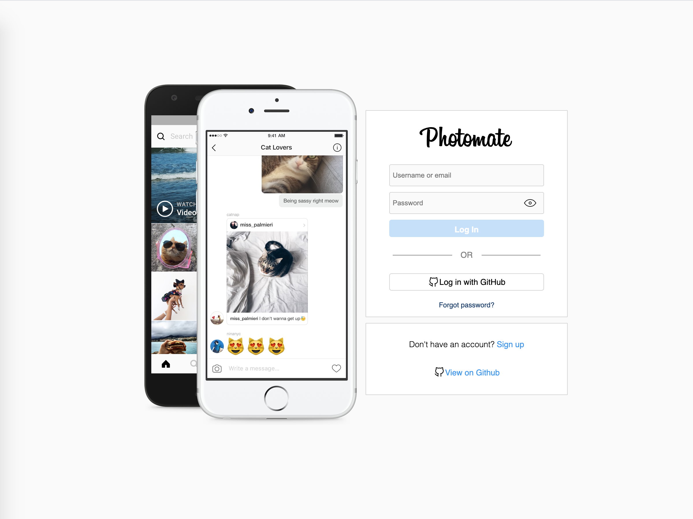
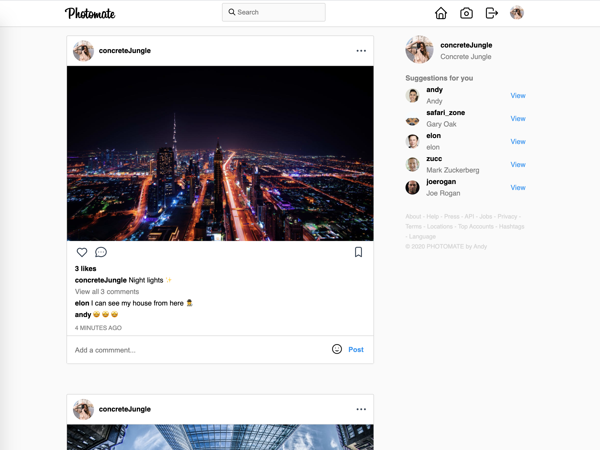
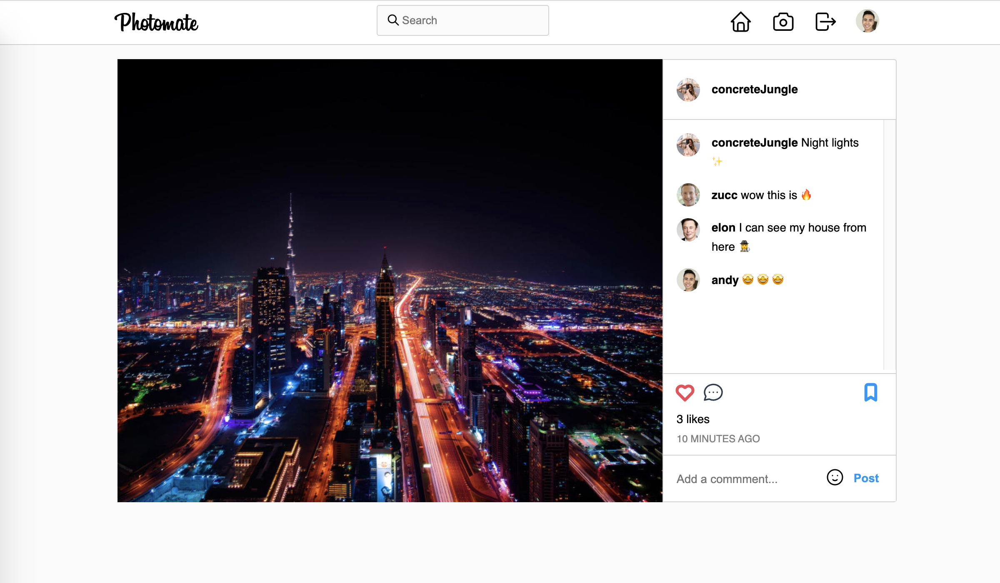

# Photomate

A fully featured photo sharing web app, based on a popular social media platform. Built with the [MERN](https://medium.com/@digimktg/what-is-mern-stack-9c867dbad302) stack.

See it live [here](https://photomate.netlify.app/).

The backend is available [here](https://github.com/andyrutherford/photomate-backend).






## Features

- User authentication using JSON web tokens or OAuth through Github.
- Reset password email if you lose access to your account.
- Create a new post with a photo and caption.
- Like, and comment other users posts.
- Save posts from other users.
- View other user profiles, and their pictures in a photo grid.
- Display a blue "Verified Badge" if you verify your identity.

## Setup

To run this application, you'll need [Git](https://git-scm.com/) and [Node.js](https://nodejs.org/) (which comes with [npm](https://www.npmjs.com/)) installed on your computer. From your command line:

```sh
# Clone this repository
$ git clone

$ cd

$ npm install

# For OAuth with Github, create a .env in the root folder with the following:
$ REACT_APP_GITHUB_CLIENT_ID=<your-github-client-id>
```

## Tech

Photomate uses a number of open source projects to work properly:

- [ReactJS](https://reactjs.org/) - A JavaScript library for building user interfaces
- [node.js](http://nodejs.org) - evented I/O for the backend
- [Cloudinary](https://cloudinary.com/) - for image storage
- [Redux](https://react-redux.js.org/) - for state management
- [axios](https://www.npmjs.com/package/axios) - promise based HTTP client for the browser and node.js
- [styled components](https://styled-components.com/) - for styled components
- [React-Toastify](https://github.com/fkhadra/react-toastify) - for alerts
- [Emoji Mart](https://github.com/missive/emoji-mart) - for emojis

Backend tech is [here](https://github.com/andyrutherford/photomate-backend#tech).

## Demo

https://photomate.netlify.app/

## License

MIT
